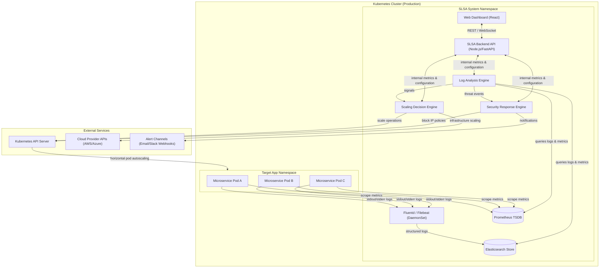
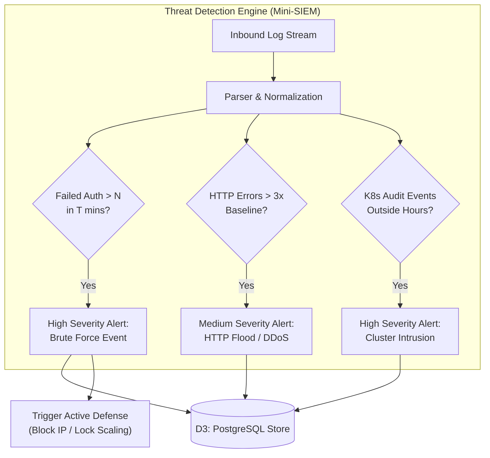
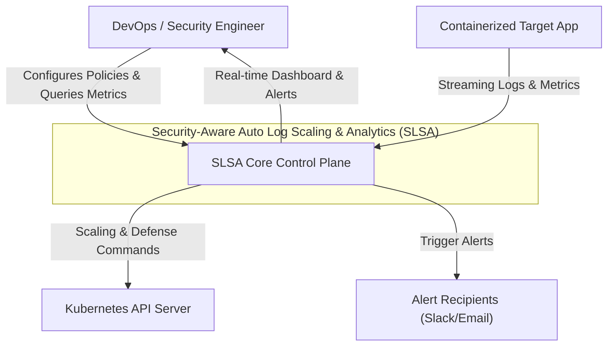
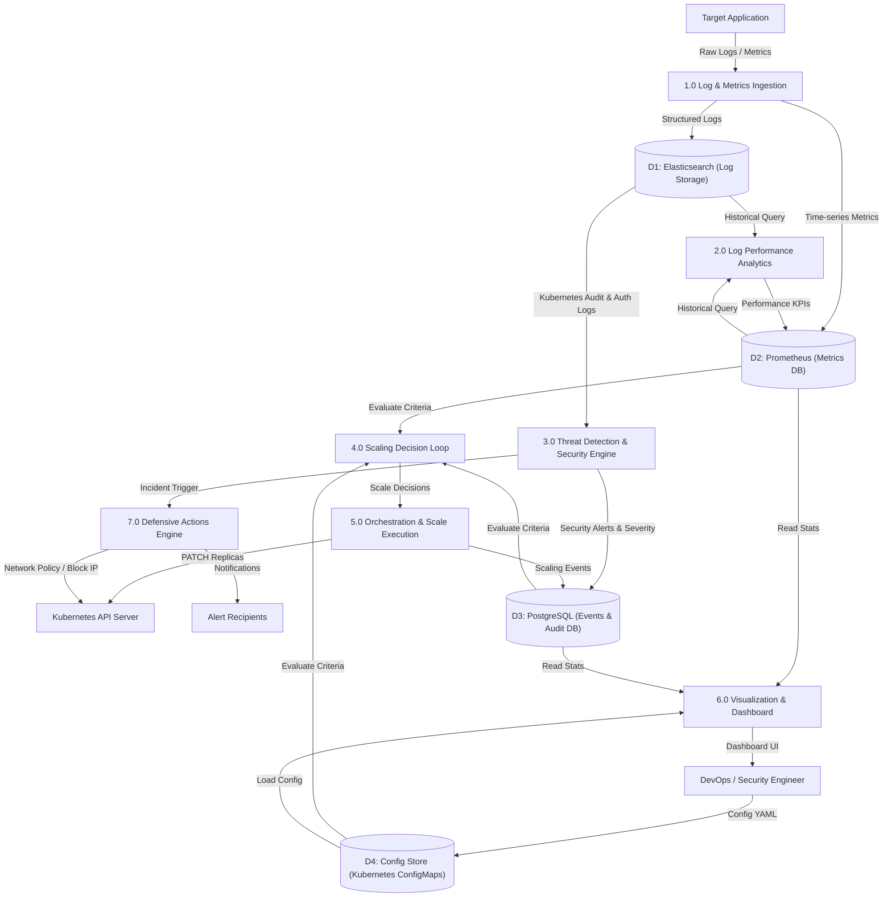
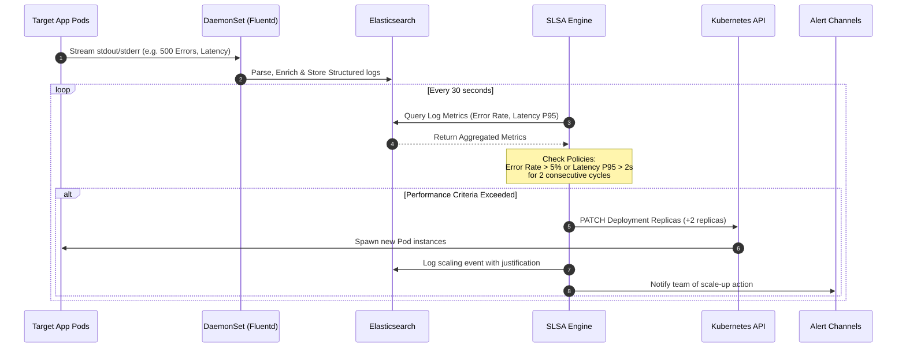
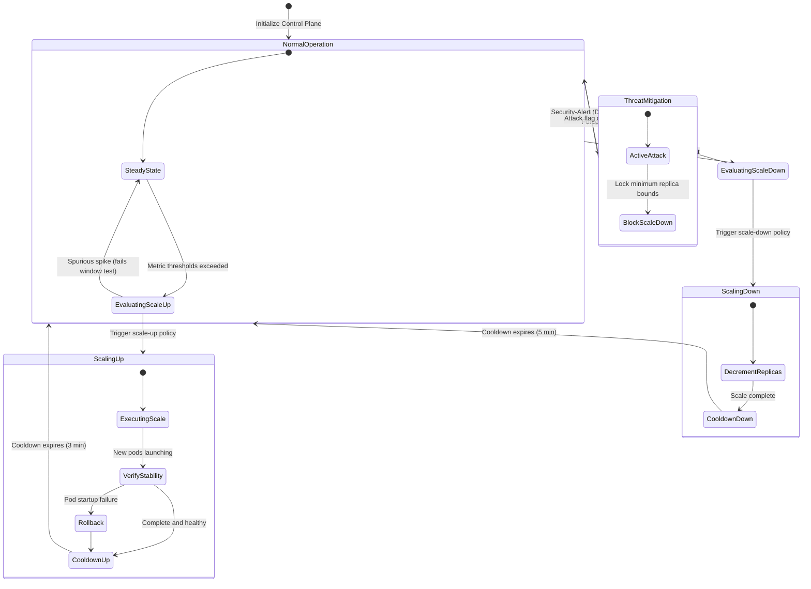

# Software Requirements Specification (SRS)

## Security-Aware Auto Log Scaling & Analytics (SLSA)
### Enterprise-Grade Auto-Scaling & Observability Platform

---

## 1. Introduction

### 1.1 Purpose
This Software Requirements Specification (SRS) describes the complete operational requirements and specifications for the **Security-Aware Auto Log Scaling & Analytics (SLSA)** system. SLSA is an intelligent, container-native cloud infrastructure management solution. It analyzes multi-dimensional application telemetry and security logs in real-time, driving automated container scaling and active defensive responses within Kubernetes environments.

This document is intended for:
*   **Platform Engineering & DevOps Teams:** For system deployment, integration, and platform scaling.
*   **Security Operations Center (SOC) & SecOps Teams:** To evaluate threat detection models, audit pipelines, and active security responses.
*   **Systems Architects:** For evaluating cluster integration, API scopes, and performance footprints.

Unlike traditional reactive CPU/memory autoscalers, SLSA correlates application-level performance metrics (latencies, error rates) and security events (brute force attacks, unauthorized admin changes) derived directly from logs to make high-fidelity scaling and security boundary decisions.

### 1.2 Product Scope
SLSA operates as a central control plane within a Kubernetes cluster, bridging application runtime logs, cluster metric servers, and container orchestration APIs.

```
┌────────────────────────────────────────────────────────────────────────┐
│                        SLSA PLATFORM BOUNDARY                          │
│                                                                        │
│   ┌──────────────────┐      ┌─────────────────┐      ┌─────────────┐   │
│   │ Ingestion Engine │ ───> │ Analytics Core  │ ───> │ Orchestrator│   │
│   │ (App, Auth,      │      │ (Perf Analytics │      │ (K8s API,   │   │
│   │  Audit Logs)     │      │  + Mini-SIEM)   │      │  NetPolicy) │   │
│   └──────────────────┘      └────────┬────────┘      └─────────────┘   │
│                                      │                                 │
│                                      ▼                                 │
│                             ┌─────────────────┐                        │
│                             │  Observability  │                        │
│                             │    Dashboard    │                        │
│                             └─────────────────┘                        │
└────────────────────────────────────────────────────────────────────────┘
```

#### In-Scope Core Capabilities:
*   **Distributed Log Collection & Ingest:** Low-latency parsing of container stdout/stderr, network ingress logs, and Kubernetes cluster audit logs.
*   **Real-time Log Analytics:** Continuous processing of HTTP status distributions, P95/P99 latency trends, and raw application exceptions.
*   **Mini-SIEM Security Engine:** Dynamic threat analytics identifying brute-force logins, HTTP anomaly floods (potential DDoS), and unauthorized/abnormal cluster operations.
*   **Security-Aware Autoscaling:** Algorithmic scaling decisions that adjust replica counts based on user load while locking down scale-downs during detected active security attacks to maintain service availability.
*   **Active Defense Automation:** Dynamic execution of automated defensive responses, such as generating network isolation policies or block-listing offending client IPs via Nginx Ingress Controller ConfigMaps.
*   **Centralized SecOps Dashboard:** Web-based interface displaying performance graphs, threat severity vectors, scaling justifications, and dynamic rule-management controls.

#### Out-of-Scope (v1 Limits):
*   **Full Enterprise SIEM Replacement:** SLSA does not target multi-year log archiving, general compliance reporting, or generic host intrusion detection.
*   **Machine Learning Threat Modeling:** Relying on deterministic, high-efficiency threshold rules rather than resource-heavy training models.
*   **Multi-Cloud Orchestration Abstraction:** Native integrations focus strictly on standard Kubernetes APIs rather than direct multi-cloud controller engines (e.g. AWS Auto Scaling Groups are driven indirectly via K8s Node Autoscalers).

### 1.3 Business Value & High-Level ROI
*   **Infrastructure Optimization:** Prevents over-provisioning during idle periods, reducing aggregate cloud compute bills by **25% to 40%** compared to static resource allocation.
*   **SLA Uptime Preservation:** Proactively scales up container instances based on traffic rate spikes and latency degradation *before* nodes exhaust memory and trigger Out-Of-Memory (OOM) failures.
*   **Cybersecurity Resilience:** Protects container resources during application-layer DDoS or credential stuffing attacks by maintaining service availability through locked scaling while actively isolating the threat.
*   **observability Overhead Reduction:** Combines metric collection and log analysis pipelines, reducing the compute overhead of running multiple fragmented monitoring daemons.

### 1.4 Definitions, Acronyms, and Abbreviations
*   **ALSA/SLSA:** Auto Log Scaling Analytics / Security-Aware Auto Log Scaling & Analytics.
*   **HPA:** Horizontal Pod Autoscaler. A Kubernetes API resource that automatically updates the workload resource (e.g., a Deployment), aiming to scale the workload to match demand.
*   **SIEM:** Security Information and Event Management. An field of computer security where software products and services combine security information management and security event management.
*   **DevSecOps:** The integration of security practices into a DevOps software development delivery model.
*   **K8s Audit Logs:** Chronological record of cluster-level administrative actions stored in JSON format, capturing API requests, payloads, and caller identities.
*   **P95/P99 Latency:** The 95th and 99th percentiles of request response times. Meaning 95% or 99% of requests are processed faster than this threshold.
*   **RPS / QPS:** Requests Per Second / Queries Per Second.
*   **RBAC:** Role-Based Access Control. A method of regulating access to computer or network resources based on the roles of individual users within an enterprise.
*   **OOM:** Out of Memory. An operating system state where no more dynamic memory can be allocated, triggering process termination.

### 1.5 References
1.  **Kubernetes API Standards:** Horizontal Pod Autoscaling (v2 API Spec).
2.  **Prometheus Metric Standards:** OpenMetrics Specification (V1.0).
3.  **OWASP Top 10 API Security:** Guidance on API protection and log hygiene practices.
4.  **Cloud Security Alliance (CSA):** Cloud-Native Logging and Auditing Best Practices.

---

## 2. Overall Description

### 2.1 Product Perspective & Context
SLSA operates as a native component of the platform infrastructure layer. It does not replace the target application code but wraps around it via standard container runtime stdout redirection and Kubernetes orchestration controls.



### 2.2 Functional Blocks
The platform consists of seven distinct logical engines:
1.  **Log Aggregator Pipeline:** Captures stdout/stderr from app containers, standardizes unstructured streams to common JSON formats, and enriches lines with pod/namespace metadata.
2.  **Performance Analytics Engine:** Scans application access logs to dynamically compute RPS, HTTP response distributions, and sliding window error trends.
3.  **Threat Detection Engine (Mini-SIEM):** Scans authentication logs for authentication floods and aggregates Kubernetes cluster API request audit logs to detect unauthorized state modifications.
4.  **Autoscaling Decision Engine:** A rules-driven controller evaluating composite performance vectors against tenant configuration guidelines while applying security lock overrides.
5.  **Dynamic Ingress & Network Controller:** Modifies active ingress rules and Kubernetes network policy specifications to restrict access from offending nodes/IPs.
6.  **Observability API Gateway:** Manages authenticated dashboard requests, streaming metrics via persistent WebSocket pipelines.
7.  **Alert Notification Engine:** Distributes critical notifications to external operational platforms (Slack Webhooks, SMTP).

### 2.3 User Personas
*   **Platform/DevOps Engineer:** Requires granular control over metric threshold bounds, scaling cooldown intervals, and resource constraints to maintain target SLA values without system oscillations.
*   **Security Analyst (SOC):** Requires granular threat logs, real-time alerting profiles, IP-blocking configurations, and audit events showing unauthorized container interactions.
*   **Systems Administrator:** Oversees standard infrastructure limits, platform user access management (RBAC), and cost efficiency configurations.

### 2.4 Product Constraints
*   **Resource Overhead Limits:** The logging pipeline and control plane components must not consume more than **5% of cluster resources** (CPU/RAM allocation limits enforced via K8s Resource Quotas).
*   **Ingestion Latency:** The system must parse and store logs with a p95 latency under **150ms** to prevent delayed scaling reactions.
*   **Local Dev Environments:** Must be runnable in restricted localized containers (Kind/Minikube) for rapid development and staging tests.
*   **Log Privacy Standards:** Must protect private user credentials, ensuring session keys, authentication strings, and passwords are dynamically masked prior to persistent database logging (SOC2 Compliance).

### 2.5 Assumptions and System Dependencies
*   **Structured Application Logs:** It is assumed that application services output structured logs to standard system out streams, or conform to predictable common formats (e.g. Apache Combined, Nginx Standard).
*   **Kubernetes Cluster Access:** The SLSA control plane requires cluster-wide ServiceAccount tokens with high-level access permissions to Deployment controllers and NetworkPolicy endpoints.
*   **Robust Network Pipeline:** High-throughput logging requires high-speed cluster networking between aggregation agents and the storage backend (Elasticsearch).

---

## 3. System Architecture & Interface Requirements

### 3.1 External System Interfaces

#### Kubernetes API Server Interface
*   **Purpose:** Reads target pod metrics and updates replica targets.
*   **Protocol:** REST API over HTTPS.
*   **Payload Format:** JSON (Kubernetes OpenAPI specification).
*   **Endpoints Utilized:**
    *   `GET /api/v1/namespaces/{namespace}/pods`
    *   `PATCH /apis/apps/v1/namespaces/{namespace}/deployments/{name}/scale`
    *   `POST /apis/networking.k8s.io/v1/namespaces/{namespace}/networkpolicies`

#### Elasticsearch / OpenSearch Storage Interface
*   **Purpose:** High-efficiency indexing and indexing searches on raw/structured log lines.
*   **Protocol:** REST over HTTP.
*   **Port Configuration:** default `9200`.
*   **Data Payload:** JSON Documents.

#### Prometheus Time-Series Database Interface
*   **Purpose:** Scraping container platform metrics and querying sliding window averages.
*   **Protocol:** HTTP Pull Metrics scraping.
*   **Port Configuration:** default `9090`.
*   **Query Syntax:** PromQL.

### 3.2 Communication & Protocol Specifications
*   **gRPC / REST APIs:** Used for internal system component communication, ensuring minimal latency and strict interface contracts.
*   **WebSockets (`ws://`, `wss://`):** Streams real-time, 5-second tick telemetry from backend engines directly to user dashboards.
*   **TLS 1.3 Encryption:** All external REST/WebSocket pipelines are wrapped with TLS 1.3 encryption certificates.
*   **SMTP & Webhooks:** Distributes payload packages to third-party alert targets, validating Slack endpoints via HTTPS POST protocols.

### 3.3 Hardware and Resource Footprints
To maintain low system overhead, SLSA components conform to the following resource footprint limits:

| Component | Target CPU Allocation | Target Memory Allocation | Disk Footprint |
| :--- | :--- | :--- | :--- |
| **SLSA Core Engine** | 0.25 vCPU | 256 MiB RAM | Minimal (Stateless) |
| **Fluentd Agent** | 0.1 vCPU per node | 128 MiB RAM per node | Minimal (Buffered) |
| **Elasticsearch Node** | 1.0 vCPU | 2.0 GiB RAM | 50 GiB SSD minimum |
| **Prometheus DB** | 0.5 vCPU | 1.0 GiB RAM | 20 GiB SSD minimum |
| **React Web Dashboard** | N/A (Client Browser) | N/A (Client Browser) | Minimal (Nginx Static) |

---

## 4. Specific Functional Requirements

### 4.1 Ingestion & Parsing
*   **FR-ING-01: Container Stdout Ingestion**
    *   The system SHALL automatically collect raw log lines output by all container instances within a specified Kubernetes namespace.
*   **FR-ING-02: Multi-Format Parser Integration**
    *   The parsing engine SHALL ingest and normalize the following log patterns:
        *   Standard JSON logs
        *   Nginx / Apache Common Access Logs
        *   Spring Boot / Python standard stack trace streams
*   **FR-ING-03: Kubernetes Metadata Enrichment**
    *   The ingestion pipeline SHALL enrich each log line with metadata keys: `k8s.namespace`, `k8s.pod_name`, `k8s.container_name`, and `system.timestamp`.
*   **FR-ING-04: Log Buffer Management**
    *   The system SHALL maintain a high-efficiency memory ring-buffer (up to 100,000 documents) to prevent data loss during ingestion spikes or Elasticsearch down periods.
*   **FR-ING-05: Cluster Audit Log Collector**
    *   The system SHALL ingest Kubernetes cluster API audit log events, parsing actor identifiers, actions (`create`, `delete`, `patch`), and resource targets.

### 4.2 Performance Analytics
*   **FR-PERF-01: Access Log Status Extraction**
    *   The engine SHALL scan access logs to extract HTTP status classifications (2xx, 3xx, 4xx, 5xx).
*   **FR-PERF-02: Response Latency Derivation**
    *   The system SHALL parse response latency values from HTTP access records, computing P50, P95, and P99 sliding averages.
*   **FR-PERF-03: Sliding Time Window Analysis**
    *   Computed metrics SHALL be calculated over sliding window frames of `1 minute`, `5 minutes`, and `15 minutes`.
*   **FR-PERF-04: Anomaly Baseline Profiling**
    *   The system SHALL maintain a rolling 1-hour average performance baseline, identifying performance anomalies when current metrics exceed two standard deviations (`> 2σ`) of the baseline.

### 4.3 Security Threat Detection (Mini-SIEM)
*   **FR-SEC-01: Brute-Force Login Pattern Detection**
    *   The engine SHALL trigger a `SECURITY_ALERT` of severity `HIGH` if it detects more than `N` failed authentication attempts (HTTP 401/403 or specific login failure log patterns) originating from the same client IP within `T` minutes.
*   **FR-SEC-02: HTTP Status Anomaly Detection**
    *   The system SHALL monitor HTTP status metrics and trigger a `SECURITY_ALERT` of severity `MEDIUM` if the frequency of 4xx or 5xx responses spikes to `> 3x` the baseline value within a 5-minute window.
*   **FR-SEC-03: Kubernetes Administrative Threat Alerts**
    *   The system SHALL flag a `SECURITY_ALERT` of severity `HIGH` if the Kubernetes audit log exposes administrative actions (`create`, `update`, `delete` operations) targeting critical resources (e.g. pods, deployments, secrets, cluster-roles) within protected production namespaces during configured off-hours.
*   **FR-SEC-04: Log Integrity Verification**
    *   The central log store SHALL write logs with tamper-evident serial indexing keys to identify log gaps or missing/altered event history.



### 4.4 Scaling Decision Control
*   **FR-SCALE-01: Evaluation Interval**
    *   The scaling engine SHALL evaluate policy metrics every `30 seconds`.
*   **FR-SCALE-02: Scale-Up Target Triggers**
    *   The engine SHALL fire a scale-up directive if any of these conditions are met:
        *   Log-derived HTTP Error Rate exceeds `5.0%` for 2 consecutive evaluation intervals.
        *   P95 Response Latency exceeds `2,000ms` for 2 consecutive intervals.
        *   Log-derived request throughput (RPS) spikes by `> 50%` compared to the 5-minute rolling average.
*   **FR-SCALE-03: Scale-Down Consolidation Guidelines**
    *   The engine SHALL only initiate a scale-down process if ALL the following conditions are met:
        *   Log-derived HTTP Error Rate remains `< 1.0%` for 10 consecutive intervals (5 minutes).
        *   P95 Latency is `< 500ms` for 10 consecutive intervals.
        *   The active replica count is above the configured minimum instance boundary.
        *   NO active security alerts have been triggered in the last 15 minutes.
*   **FR-SCALE-04: Cooldown Restrictive Timers**
    *   The engine SHALL enforce strict cooldown intervals to prevent scaling oscillations:
        *   Scale-up Cooldown: `3 minutes` minimum before subsequent scale-up events.
        *   Scale-down Cooldown: `5 minutes` minimum before subsequent scale-down events.
*   **FR-SCALE-05: Security-Aware Scaling Modifier**
    *   If a `SECURITY_ALERT` of severity `HIGH` (e.g. an active brute-force or DDoS attack) is detected:
        *   The system SHALL lock the replica count to prevent scaling down, preserving application availability.
        *   The system MAY trigger a scale-up operation if resources are strained under the attack vector, regardless of performance metrics.
*   **FR-SCALE-06: Manual Scaling Override Bypass**
    *   The system SHALL support an administrative override to disable automated scaling entirely, allowing manual replica counts to be locked in via the API/UI.

### 4.5 Orchestration & Defensive Response
*   **FR-DEF-01: Replica Scaling Actions**
    *   The orchestration engine SHALL update pod deployments by directly patching replica metrics in the Kubernetes API.
*   **FR-DEF-02: Pod Launch Validation**
    *   The engine SHALL verify pod launch health within `60 seconds` of a scaling PATCH call. If new pods fail health checks, the system SHALL rollback the operation and trigger an alert.
*   **FR-DEF-03: Dynamic IP Blocklist Execution**
    *   When an active brute-force attack from a specific IP is flagged:
        *   The defensive response service SHALL write the offending IP to a designated Kubernetes ConfigMap.
        *   This ConfigMap updates the ingress controller configurations (e.g. Nginx Deny list) dynamically, returning HTTP 403 Forbidden to the attacker before hitting application code.
*   **FR-DEF-04: Dynamic Isolation Network Policy**
    *   The defensive service SHALL be able to construct and deploy a local Kubernetes `NetworkPolicy` mapping to isolate compromised pods, restricting their communication path to database and system nodes.

### 4.6 Visualization & Alerting
*   **FR-VIS-01: Real-time Telemetry Dashboard**
    *   The web dashboard SHALL display live updates (updated every 5 seconds) of:
        *   Current replica count and resource footprint graphs.
        *   Log-derived HTTP request rates and error distributions.
        *   Latency percentiles timeline.
*   **FR-VIS-02: Scaling Action Log Timeline**
    *   The UI SHALL show an audit timeline detailing scaling decisions, including the starting replica count, updated count, timestamp, and metrics justifications (i.e. rules that triggered the scale).
*   **FR-VIS-03: Dedicated Security Incident Board**
    *   The UI SHALL provide a security dashboard displaying an active timeline of threat events, severity flags, offending IPs, and manual toggle controls to block/unblock specific nodes.
*   **FR-VIS-04: Metric Data Export Utility**
    *   The system SHALL allow users to export performance metrics and event logs in standard CSV/JSON format for external auditing.
*   **FR-VIS-05: Multi-Channel Alert Gateway**
    *   The alert manager SHALL forward `HIGH` severity notifications via email (SMTP) and configure webhooks for real-time Slack/Teams alert channels.

---

## 5. Non-Functional Requirements

### 5.1 System Performance & SLA Targets
*   **Ingestion Processing Boundary (NFR-PERF-01):** The logging infrastructure must parse and index logs with a p95 latency under **150ms** under a base load of 5,000 logs/second.
*   **Scale Trigger Execution Time (NFR-PERF-02):** The elapsed time from meeting scale criteria to executing a scale PATCH on the Kubernetes API MUST be less than **5 seconds**.
*   **Dashboard Page Load Limits (NFR-PERF-03):** The primary view dashboard page MUST load within **2.0 seconds** under average user network connections.

### 5.2 Reliability & Fault Tolerance
*   **High-Availability Data Storage (NFR-REL-01):** The Elasticsearch log storage and PostgreSQL metadata databases MUST run in multi-node configurations, ensuring no data loss in the event of a single node crash.
*   **Component Isolation & Fail-Safe Degradation (NFR-REL-02):** If Elasticsearch is offline:
    *   The system SHALL transition to standard CPU/Memory scaling fallback modes.
    *   The dashboard SHALL display a clear degradation status indicator.
*   **Self-Healing Pod Controllers (NFR-REL-03):** SLSA core modules running in Kubernetes must incorporate liveness and readiness probes, enabling self-healing container restarts.

### 5.3 Security Hardening & Regulatory Compliance
*   **Data Masking Protocols (NFR-SEC-01):** High-risk parameters (passwords, JWT structures, credit card matches) detected in application logs MUST be replaced with wildcard characters `[REDACTED]` prior to index storage.
*   **Access Authentication Controls (NFR-SEC-02):** All API and web endpoints require JWT (JSON Web Token) authorization protocols using modern hashing engines (e.g. SHA-256).
*   **Least-Privilege Cluster Access (NFR-SEC-03):** The SLSA Kubernetes ServiceAccount MUST operate under restricted RBAC guidelines, limited strictly to endpoints in target application namespaces:

```yaml
apiVersion: rbac.authorization.k8s.io/v1
kind: Role
metadata:
  namespace: production
  name: slsa-operator-role
rules:
- apiGroups: ["apps"]
  resources: ["deployments", "deployments/scale"]
  verbs: ["get", "list", "patch", "update"]
- apiGroups: [""]
  resources: ["pods", "configmaps", "services"]
  verbs: ["get", "list", "watch", "update", "patch"]
- apiGroups: ["networking.k8s.io"]
  resources: ["networkpolicies"]
  verbs: ["create", "get", "list", "delete", "patch"]
```

### 5.4 Usability & Maintainability
*   **Clean YAML Config Architecture (NFR-US-01):** Core operations (metric thresholds, response actions) must be controlled via a single standard YAML file mounted as a Kubernetes ConfigMap.
*   **OpenAPI Interface Documentation (NFR-US-02):** API endpoints must conform to standard REST protocols, self-documenting via OpenAPI Swagger interfaces.

---

## 6. System Models & Process Flows

### 6.1 DFD Level 0 (Context Diagram)
The Level 0 Data Flow Diagram isolates the primary external interfaces and boundary endpoints interacting with the SLSA core system.



### 6.2 DFD Level 1 (System Decomposition)
The Level 1 Diagram exposes the inner process blocks, data flow paths, and persistent storage directories operating within the platform control boundaries.



### 6.3 Use Case Diagram
The Use Case specifications outline the administrative operations available to platform engineers, SecOps agents, and system infrastructure administrators.

```mermaid
leftToRightDirection
graph TD
    %% Actors
    DevOps["DevOps Engineer"]
    Security["Security Analyst"]
    Admin["System Administrator"]
    
    subgraph UseCases["SLSA Core Use Cases"]
        UC1["View Real-time Metrics"]
        UC2["Configure Scaling & Security Policies"]
        UC3["Review Scaling Events"]
        UC4["Monitor Security Alerts"]
        UC5["Export Audits & Metrics"]
        UC6["Manual Scaling Override"]
        UC7["Manage System Access & RBAC"]
        UC8["Toggle Defensive IP Blocking"]
    end
    
    DevOps --> UC1
    DevOps --> UC2
    DevOps --> UC3
    DevOps --> UC5
    DevOps --> UC6
    
    Security --> UC1
    Security --> UC3
    Security --> UC4
    Security --> UC5
    Security --> UC8
    
    Admin --> UC2
    Admin --> UC7
    Admin --> UC8
```

### 6.4 Sequence Diagram (Auto Scale-Up Flow)
Illustrates the time-ordered sequence of interactions required to register, index, analyze, and scale target microservices under severe load.



### 6.5 State Diagram (Autoscaling Decision States)
Traces the internal scaling and security operational mode transitions of the SLSA decision engine.



---

## 7. Configuration Model

Core behaviors (metric thresholds, response actions) are mapped within a single, versioned YAML configuration file, `slsa-config.yaml`, enabling live-reloads without interrupting critical services.

```yaml
# slsa-config.yaml
# Production Config Profile for Security-Aware Log Scaling & Analytics (SLSA)
---
system:
  name: "Security-Aware Log Scaling & Analytics"
  version: "1.0.0"
  environment: "production"
  evaluation_interval: 30s

target:
  namespace: "production"
  deployment: "payment-gateway"
  min_instances: 3
  max_instances: 25

scaling_policies:
  scale_up:
    conditions:
      - metric: error_rate
        threshold: 5.0
        unit: percent
        duration: 1m
      - metric: response_time_p95
        threshold: 2000
        unit: milliseconds
        duration: 1m
      - metric: exception_rate
        threshold: 15
        unit: per_minute
        duration: 30s
    increment: 2
    cooldown: 3m

  scale_down:
    conditions:
      - metric: error_rate
        threshold: 1.0
        unit: percent
        duration: 5m
      - metric: response_time_p95
        threshold: 450
        unit: milliseconds
        duration: 5m
    decrement: 1
    cooldown: 5m

security_rules:
  brute_force:
    enabled: true
    failed_logins_threshold: 10
    time_window: 2m
    action: block_ip

  http_anomaly:
    enabled: true
    baseline_window: 15m
    spike_factor: 3.0
    action: raise_alert

  k8s_admin_anomaly:
    enabled: true
    sensitive_namespaces: ["production", "kube-system"]
    allowed_working_hours: "08:00-18:00"
    action: lockdown_scaling

security_response:
  auto_block_ip:
    enabled: true
    ingress_configmap: "nginx-ingress-blocklist"
    ingress_namespace: "ingress-nginx"
  alert_channels:
    email:
      enabled: true
      recipients:
        - "soc@company.com"
        - "devops-alerts@company.com"
    webhook:
      enabled: true
      endpoint: "https://hooks.slack.com/services/T00/B00/X00"
```

---

## 8. Production Implementation & Testing Roadmap

### 8.1 Implementation Milestones

```
┌────────────────────────────────────────────────────────────────────────┐
│ M1: Logging Pipeline  ==>  M2: Perf Scaling  ==>  M3: Security Audit   │
│                                                                        │
│ M4: Active Defense    ==>  M5: E2E Load Test & Prod Deployment         │
└────────────────────────────────────────────────────────────────────────┘
```

#### Milestone 1: Core Logging Pipeline & Ingest Stacks
*   Deploy multi-node Elasticsearch and Prometheus server assets inside Kubernetes environment.
*   Deploy Fluentd collectors as cluster DaemonSets.
*   Configure log ingestion mappings for structured JSON, Nginx, and exception traces.

#### Milestone 2: Performance Analytics & Autoscaling Loop
*   Implement log parsing queries to derive error rates, latencies, and transaction trends.
*   Develop the 30-second autoscaling evaluation loop.
*   Establish Kubernetes API interface client to patch deployment replica values.

#### Milestone 3: Security Analytics Engine & Audit pipelines
*   Enable Kubernetes audit logging pipelines.
*   Develop threat analytics queries for brute-force login and HTTP anomaly floods.
*   Implement state databases to persist security alerts with severity classifications.

#### Milestone 4: Active Defense Integration & Dashboard
*   Establish automated defensive responders (Ingress block ConfigMaps and K8s network isolation profiles).
*   Create backend WebSocket servers to stream live metric fields.
*   Develop the SecOps React Web Dashboard UI.

#### Milestone 5: E2E Load-Testing & Production Deployment
*   Integrate automated end-to-end testing pipelines.
*   Execute load simulation test structures using Locust (generating up to 10,000 events/second).
*   Polish logging mechanisms, finalize RBAC security limits, and deploy Helm package modules.

### 8.2 Testing Strategy

#### Unit Testing
*   **Target Scope:** Validation of independent modular calculations (log parsers, metric calculators, decision rules).
*   **Coverage Target:** `> 80%` code coverage.
*   **Frameworks:** Jest (Node.js backend), Pytest (Python Analytics Engine).

#### Integration Testing
*   **Target Scope:** Validation of interface pathways (e.g. validating database read/writes, verifying API endpoint configurations).
*   **Frameworks:** Supertest (REST testing), Mock K8s API clients.

#### End-to-End Dynamic Load Testing
*   **Target Scope:** Generating simulated load trends to verify target scaling behavior.
*   **Tooling:** Locust / JMeter infrastructure.
*   **Validation Rules:** Ensure node scale up is triggered within 60 seconds of error spikes, verifying no log buffers overflow.

#### Chaos & Resiliency Testing
*   **Target Scope:** Simulating container and interface failures.
*   **Scenarios Evaluated:** Terminating log store (Elasticsearch) nodes under load, verifying fallback to metric CPU/memory scaling.

#### Security & Penetration Testing
*   **Target Scope:** Log injection protection, authentication validation, and RBAC boundary enforcement checks.

### 8.3 Enterprise Success Criteria
*   **Technical Performance Milestones:**
    *   Scale-up execution completed in `< 5 seconds` of trigger event verification.
    *   Zero log data loss recorded during peak throughput of 5,000 logs/second.
    *   False-positive threat alerts recorded at `< 1.0%` under standard user traffic profiles.
*   **Operational Infrastructure Metrics:**
    *   Achieve **30% average reduction** in aggregate platform compute bills compared to static configurations.
    *   Maintain application availability SLA boundaries (`> 99.95%`) under load-spike situations.

---

## 9. Appendix A: REST API Endpoints

### 9.1 Metrics Summary
*   **Endpoint:** `GET /api/v1/metrics/summary`
*   **Response Payload (`application/json`):**

```json
{
  "status": "success",
  "data": {
    "timestamp": "2026-06-01T18:05:00Z",
    "metrics": {
      "request_rate_rps": 482.5,
      "error_rate_percent": 1.25,
      "latency_p95_ms": 320.0,
      "exception_count_per_min": 2
    },
    "cluster": {
      "target_deployment": "payment-gateway",
      "current_replicas": 5,
      "healthy_replicas": 5,
      "cpu_utilization_percent": 68.2
    }
  }
}
```

### 9.2 Scaling Events History
*   **Endpoint:** `GET /api/v1/events/scaling`
*   **Query Parameters:** `limit=10&offset=0`
*   **Response Payload:**

```json
{
  "status": "success",
  "data": [
    {
      "event_id": "evt_98b50e2d-dc99-43ef-b387-052637738f61",
      "timestamp": "2026-06-01T17:58:30Z",
      "target": "payment-gateway",
      "action": "SCALE_UP",
      "replica_change": {
        "previous": 3,
        "updated": 5
      },
      "trigger_reason": "Log-derived P95 response latency exceeded 2000ms threshold (current: 2450ms) for 2 consecutive cycles.",
      "security_context": "PERFORMANCE_DRIVEN"
    }
  ]
}
```

### 9.3 Security Alerts Timeline
*   **Endpoint:** `GET /api/v1/events/security`
*   **Query Parameters:** `severity=HIGH&resolved=false`
*   **Response Payload:**

```json
{
  "status": "success",
  "data": [
    {
      "alert_id": "sec_f3928023-8239-1599-6705-518239280238",
      "timestamp": "2026-06-01T18:02:15Z",
      "threat_type": "BRUTE_FORCE_ATTACK",
      "severity": "HIGH",
      "source_ip": "198.51.100.42",
      "details": {
        "failed_attempts": 14,
        "time_window_seconds": 120,
        "target_endpoint": "/api/v1/auth/login"
      },
      "active_defense_executed": {
        "action": "BLOCK_IP",
        "target_resource": "nginx-ingress-blocklist",
        "status": "APPLIED"
      },
      "resolved": false
    }
  ]
}
```

### 9.4 Update Dynamic Configuration
*   **Endpoint:** `POST /api/v1/config`
*   **Request Payload:**

```json
{
  "scaling_policies": {
    "scale_up": {
      "increment": 3
    }
  },
  "security_rules": {
    "brute_force": {
      "failed_logins_threshold": 15
    }
  }
}
```

*   **Response Payload:**

```json
{
  "status": "success",
  "message": "Configuration updated and dynamic reload triggered across active control engines.",
  "timestamp": "2026-06-01T18:06:12Z"
}
```
