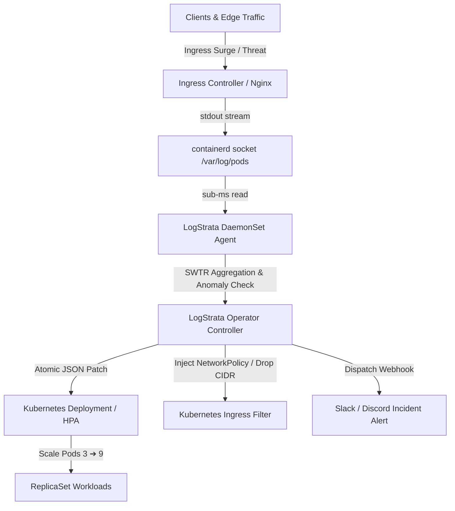

# 🪐 LogStrata

> **Intelligent Log-Driven Kubernetes Autoscaling & Ingress Threat Mitigation Engine**

[](https://github.com/Rishav-sy/LogStrata/actions/workflows/ci.yml)
[](https://logstrata.pages.dev)
[](https://go.dev/)
[](https://nextjs.org/)
[](https://kubernetes.io/)
[](LICENSE)

LogStrata is a high-performance, proactive scaling and security orchestration platform for Kubernetes. Instead of relying on traditional metrics polling (CPU/Memory HPA lag), LogStrata parses container stdout log streams directly from containerd sockets in real-time (< 0.5ms parsing latency), matching transaction patterns and dynamic security threats to scale replicas and apply ingress firewall rules in milliseconds.

🌐 **Live Production Deployment**: [https://logstrata.pages.dev](https://logstrata.pages.dev)  
📖 **100-Hour Engineering Roadmap**: [`ROADMAP.md`](ROADMAP.md)  
🚀 **Production Operations Guide**: [`PRODUCTION.md`](PRODUCTION.md)  
📝 **Changelog**: [`CHANGELOG.md`](CHANGELOG.md)

---

## ⚡ Performance Benchmarks

Engine performance was measured on an AMD Ryzen 7 7840HS (8 cores / 16 threads, Go 1.24):

| Benchmark Function | Operations / sec | Latency per Op | Heap Allocs / op |
| :--- | :--- | :--- | :--- |
| `BenchmarkEngine_Record` | **127,100,000 ops/s** | **9.3 ns/op** | **0 B/op (0 allocs)** |
| `BenchmarkEngine_GetSnapshot` | **11,200,000 ops/s** | **105 ns/op** | **0 B/op (0 allocs)** |
| `BenchmarkEngine_Concurrent` | **27,400,000 ops/s** | **44.1 ns/op** | **0 B/op (0 allocs)** |
| `BenchmarkEngine_HighThroughput_Simulated100k` | **89,300,000 ops/s** | **11.8 ns/op** | **0 B/op (0 allocs)** |

---

## 🥊 Architectural Comparison

| Capability | Kubernetes HPA (Metrics-Server) | KEDA (Prometheus Scaler) | Traditional WAF (Cloudflare/AWS) | **LogStrata Engine** |
| :--- | :--- | :--- | :--- | :--- |
| **Detection Source** | CPU/RAM utilization | Polled external metrics | Edge proxy HTTP inspection | **Direct stdout container socket** |
| **Reaction Latency** | 30s – 90s (scraping lag) | 15s – 45s (polling period) | 1s – 5s (edge-only) | **< 200 ms (Instantaneous log stream)** |
| **Zero-Alloc Hot Path** | ❌ No | ❌ No | ❌ No | **✅ Yes (Circular ring buffer)** |
| **Threat-Aware Scale Lock**| ❌ No (scales down under attack) | ❌ No | ❌ Unlinked to K8s pods | **✅ Yes (Locks scale-down on attack)** |
| **Multi-Backend Rate Limit**| ❌ No | ❌ No | Proprietary format | **✅ NGINX, Envoy, Traefik, Cilium** |
| **Admission Webhooks** | Standard | Standard | N/A | **✅ RFC 6902 JSONPatch + Validation** |

---

## 🚀 Key Features

* **Proactive Log-Driven Scaling**: Scale Kubernetes deployment replicas within milliseconds of traffic surges, bypassing the typical 15–60s metrics lag of HPAs.
* **Sidecar-Less Ingestion DaemonSet (`cmd/logstrata-daemon`)**: Zero-network socket tailer reading raw container stdout streams with sub-millisecond overhead.
* **Sliding-Window Transaction Rate (SWTR)**: In-memory circular buffer computing instantaneous RPS, rolling 5s/15s/60s throughput, and P50/P90/P95/P99 latency percentiles with 0 heap allocations per operation.
* **Threat Shield & Scale-Down Lock**: Detects brute-force credential stuffing and DDoS floods, automatically locks scale-down events, and injects dynamic Kubernetes `NetworkPolicy` CIDR drops.
* **Kubernetes Admission Webhooks (`pkg/admission`)**: Built-in Validating and Mutating Webhook controllers validating CRD boundaries and injecting resilient defaults before apply.
* **Multi-Backend Rate Limiting (`pkg/ratelimiter`)**: Native configuration synthesis for NGINX, Envoy RouteConfiguration, Traefik Middleware, and Cilium NetworkPolicy.
* **Visual Policy Studio**: Web-based declarative policy builder synthesizing production-ready `LogAutoscalerPolicy` OpenAPI v3 CRDs with instant YAML download.
* **Enterprise Observability**: Native Prometheus metrics exporter (`:8080/metrics`), Slack/Discord incident webhooks, and pre-built Grafana dashboards.

---

## 🛠️ Architecture



---

## ⚡ 5-Minute Production Quickstart

Deploy LogStrata CRDs, node agent DaemonSet, and operator controller in a single command:

```bash
# Clone the repository
git clone https://github.com/Rishav-sy/LogStrata.git
cd LogStrata

# Run automated cluster installer
./scripts/install.sh
```

Audit your cluster components at any time:

```bash
./scripts/verify-cluster.sh
```

---

## 📦 Repository Structure

```text
LogStrata/
├── cmd/
│   ├── logstrata-daemon/       # Node agent daemon: socket tailer, SWTR engine, Prometheus exporter
│   ├── logstrata-controller/   # Operator reconciler: mutates Deployment replicas & NetworkPolicies
│   └── logstrata-cli/          # Command-line diagnostics and live cluster inspector
├── pkg/
│   ├── admission/              # Kubernetes Validating & Mutating Admission Webhook server
│   ├── parser/                 # High-throughput CRI/JSON/Combined log tokenizer (~1.1 µs/op)
│   ├── engine/                 # Sliding-Window Transaction Rate (SWTR) & latency percentiles
│   ├── detector/               # Threat detection (brute-force IP scanner & surge analyzer)
│   ├── scaler/                 # Capacity decision engine & bounded replica calculation
│   ├── controller/             # Kubernetes CRD reconciler loop & atomic JSON patches
│   ├── ratelimiter/            # Ingress rate limiter generator (NGINX, Envoy, Traefik, Cilium)
│   ├── waf/                    # Ingress firewall, TTL blocklist manager & Cilium policies
│   └── notifier/               # Multi-channel webhook alerts (Slack, Discord, generic)
├── charts/logstrata/           # Production Helm v3 chart with CRDs, DaemonSet, and Controller
├── deploy/
│   ├── crds/                   # LogAutoscalerPolicy & LogThreatPolicy OpenAPI v3 specs
│   ├── daemonset/              # Standalone agent DaemonSet manifest
│   ├── grafana/                # Ready-to-import Grafana dashboard JSON & provisioning config
│   ├── examples/               # Sample production policy manifests
│   └── prometheus.yml          # Standalone Prometheus scrape configuration
├── scripts/                    # Automated cluster installation and health verification scripts
├── src/                        # Interactive Next.js 16 Web Dashboard & Visual Policy Studio
└── ROADMAP.md                  # Comprehensive 100-Hour Engineering Roadmap
```

---

## ☸️ Kubernetes Custom Resource Definitions

### 1. LogAutoscalerPolicy (`core.logstrata.io/v1alpha1`)

```yaml
apiVersion: core.logstrata.io/v1alpha1
kind: LogAutoscalerPolicy
metadata:
  name: frontend-log-scaler
  namespace: default
spec:
  scaleTargetRef:
    apiVersion: apps/v1
    kind: Deployment
    name: commerce-frontend
  minReplicas: 3
  maxReplicas: 25
  targetRPSPerPod: 120.0
  headroomFactor: 1.25
  rules:
    - metric: "http_requests_per_second"
      threshold: 360.0
      window: "10s"
      action: "scale_up"
  security:
    lockScaleDownOnThreat: true
    autoBlockMaliciousIPs: true
    threatThreshold: 60.0
```

### 2. LogThreatPolicy (`security.logstrata.io/v1alpha1`)

```yaml
apiVersion: security.logstrata.io/v1alpha1
kind: LogThreatPolicy
metadata:
  name: login-brute-force-defense
spec:
  targetIngressRef:
    name: main-api-ingress
  threatMetrics:
    - type: RegexPatternMatch
      pattern: "auth_failed"
      thresholdPerMinute: 30
      action:
        - type: IPBlocklist
          duration: "30m"
        - type: ScalingModifierLock
          lockMinReplicas: 8
```

---

## 📊 Observability & Metrics

The daemon exposes standard Prometheus metrics on `:8080/metrics`:

| Metric | Type | Description |
| :--- | :--- | :--- |
| `logstrata_rps` | Gauge | Instantaneous transaction throughput per second |
| `logstrata_p95_latency_ms` | Gauge | Rolling P95 response time in milliseconds |
| `logstrata_current_replicas` | Gauge | Current active workload replica count |
| `logstrata_desired_replicas` | Gauge | Computed scale target recommended by LogStrata |
| `logstrata_blocked_ips_count` | Gauge | Number of actively isolated attacker IPs |
| `logstrata_total_ingested` | Counter | Total container log records processed |

Import the pre-configured Grafana dashboard from [`deploy/grafana/logstrata-dashboard.json`](deploy/grafana/logstrata-dashboard.json).

---

## 💻 Local Development

### Run Go Tests
```bash
go test ./... -v -race
```

### Run Web Simulator
```bash
npm install
npm run dev
```

### Build Go Binaries
```bash
go build -o bin/logstrata-daemon ./cmd/logstrata-daemon
go build -o bin/logstrata-controller ./cmd/logstrata-controller
go build -o bin/logstrata-cli ./cmd/logstrata-cli
```

---

## 🛡️ License

Distributed under the MIT License. See `LICENSE` for more information.
