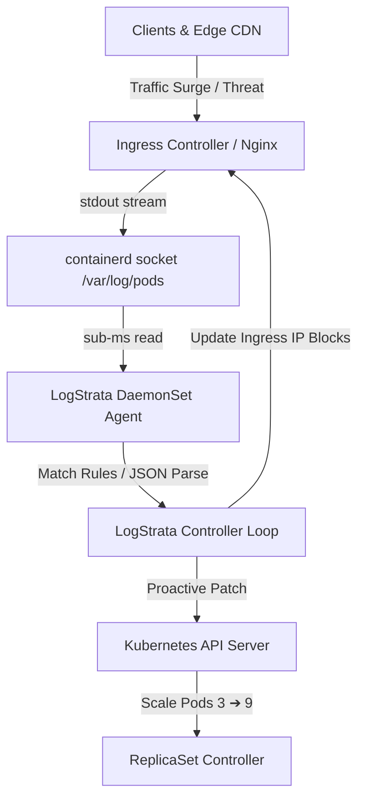

# 🪐 LogStrata

> **Log-Driven Kubernetes Autoscaling & Dynamic DevSecOps Simulation Playground**

LogStrata is a high-performance, proactive scaling and security orchestration engine. Instead of relying on traditional metrics polling (CPU/Memory HPA lag), LogStrata parses container stdout log streams directly from containerd sockets in real-time, matching transaction patterns and dynamic security threats to scale replicas and apply ingress firewall rules in milliseconds.

This repository hosts the **LogStrata Interactive DevOps Simulation Lab**, a real-time playground where developers can visualize ingress traffic, inject network failures/chaos anomalies, configure autoscaling bounds, and watch the cluster respond in real-time.

---

## 🚀 Key Features

*   **Proactive Log-Driven scaling**: Mutate Kubernetes deployment replicas within milliseconds of traffic surges, bypassing the typical 15-60s metrics lag of HPAs.
*   **DevOps Chaos Simulation Lab**: Inject primary database failures, upstream API 500 error storms, JWT authentication faults, and service outage events.
*   **Custom Config Templates**: Save, load, and delete custom playground configuration states directly using local browser storage (`localStorage`).
*   **Secure Session Management**: Integrated client-side Supabase authentication supporting both traditional Email/Password and Google OAuth sign-in flows.
*   **Telemetry & Event Timeline**: Interactive HTML5 canvas charts showing CPU/error logs, a live log stream terminal, and a chronological event timeline.
*   **CDN Traffic Globe**: A 3D Three.js / React Three Fiber interactive globe visualizing inbound traffic requests from global CDN edge locations.

---

## 🛠️ Architecture

LogStrata runs as a lightweight daemonset on nodes, reading local containerd socket streams with zero overhead.



---

## 📦 Tech Stack

*   **Framework**: Next.js (App Router, Tailwind CSS, Stark aesthetics)
*   **3D Globe Visual**: Three.js / React Three Fiber / Canvas Reveal Effects
*   **Telemetry Canvas**: Native HTML5 2D Canvas Renderer
*   **Authentication**: Supabase Auth Client SDK
*   **Deployment**: Cloudflare Pages / Workers (static export build)

---

## ⚙️ Getting Started

### Prerequisites

*   Node.js (v18 or higher)
*   Supabase Project (for Authentication credentials)

### 1. Clone the repository & Install dependencies

```bash
git clone https://github.com/yourusername/LogStrata.git
cd LogStrata
npm install
```

### 2. Configure Environment Variables

Create a `.env.local` file in the root directory:

```env
NEXT_PUBLIC_SUPABASE_URL=https://your-project-id.supabase.co
NEXT_PUBLIC_SUPABASE_ANON_KEY=your-supabase-anon-key
```

### 3. Run Development Server

```bash
npm run dev
```

Open [http://localhost:3000](http://localhost:3000) to view the application in the browser.

### 4. Build & Export Static Site

```bash
npm run build
```

The static build will be generated in the `out/` directory, ready to be hosted on static platforms like Cloudflare Pages.

---

## ☁️ Cloudflare Pages Deployment

Deploy directly using Wrangler:

```bash
npm run deploy
```

*(This runs `wrangler pages deploy out --project-name logstrata --branch main`)*

---

## 🛡️ License

Distributed under the MIT License. See `LICENSE` for more information.
