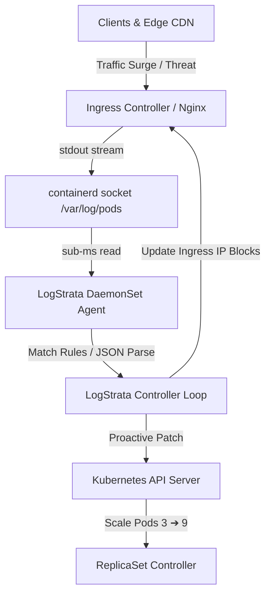

# 🪐 LogStrata

> **Log-Driven Kubernetes Autoscaling & Dynamic DevSecOps Simulation Playground**

[](https://github.com/Rishav-sy/LogStrata/actions/workflows/ci.yml)
[](https://logstrata.pages.dev)
[](https://nextjs.org/)
[](https://kubernetes.io/)
[](https://www.docker.com/)

LogStrata is a high-performance, proactive scaling and security orchestration engine. Instead of relying on traditional metrics polling (CPU/Memory HPA lag), LogStrata parses container stdout log streams directly from containerd sockets in real-time, matching transaction patterns and dynamic security threats to scale replicas and apply ingress firewall rules in milliseconds.

This repository hosts the **LogStrata Interactive DevOps Simulation Lab**, a real-time playground where developers can visualize ingress traffic, inject network failures/chaos anomalies, configure autoscaling bounds, and watch the cluster respond in real-time.

🌐 **Live Production Deployment**: [https://logstrata.pages.dev](https://logstrata.pages.dev)

---

## 🚀 Key Features

* **Proactive Log-Driven Scaling**: Mutate Kubernetes deployment replicas within milliseconds of traffic surges, bypassing the typical 15–60s metrics lag of HPAs.
* **DevOps Chaos Simulation Lab**: Inject primary database failures, upstream API 500 error storms, JWT authentication faults, and service outage events.
* **Custom Config Templates**: Save, load, and delete custom playground configuration states directly using browser `localStorage`.
* **Secure Session Management**: Integrated client-side Supabase authentication supporting both traditional Email/Password and Google OAuth sign-in flows.
* **Telemetry & Event Timeline**: Interactive HTML5 canvas charts showing CPU/error logs, a live log stream terminal, and a chronological event timeline.
* **CDN Traffic Globe**: A 3D Three.js / React Three Fiber interactive globe visualizing inbound traffic requests from global CDN edge locations.
* **Production Deployment Ready**: Native support for Cloudflare Pages, Docker multi-stage builds, and Kubernetes Helm packaging.

---

## 🛠️ Architecture

LogStrata runs as a lightweight daemonset on nodes, reading local containerd socket streams with zero overhead.



---

## 📦 Tech Stack

* **Framework**: Next.js 16 (App Router, Tailwind CSS, Stark aesthetics)
* **3D Globe Visual**: Three.js / React Three Fiber / COBE WebGL
* **Telemetry Canvas**: Native HTML5 2D Canvas Renderer
* **Authentication**: Supabase Auth Client SDK
* **Containerization**: Docker (multi-stage Nginx) & Docker Compose
* **Orchestration**: Kubernetes Helm Charts & Custom Resource Definitions (CRDs)
* **Edge Deployment**: Cloudflare Pages / Workers

---

## ⚙️ Getting Started

### Prerequisites

* Node.js (v18 or higher)
* Supabase Project (for Authentication credentials)

### 1. Clone the repository & Install dependencies

```bash
git clone https://github.com/Rishav-sy/LogStrata.git
cd LogStrata
npm install
```

### 2. Configure Environment Variables

Create a `.env.local` file in the root directory:

```env
NEXT_PUBLIC_SUPABASE_URL=https://your-project-id.supabase.co
NEXT_PUBLIC_SUPABASE_ANON_KEY=your-supabase-anon-key
```

### 3. Run Development Server

```bash
npm run dev
```

Open [http://localhost:3000](http://localhost:3000) to view the application in the browser.

### 4. Build & Export Static Site

```bash
npm run build
```

The static build will be generated in the `out/` directory, ready to be hosted on static platforms like Cloudflare Pages.

---

## 🐳 Docker & Docker Compose

Run the entire playground locally in a containerized Nginx environment:

```bash
# Build and run with Docker Compose
docker compose up -d

# Or build the Docker image directly
docker build -t logstrata-playground .
docker run -p 3000:80 logstrata-playground
```

Access the app at [http://localhost:3000](http://localhost:3000).

---

## ☸️ Kubernetes Deployment

### Deploying the Playground via Helm

Install the chart directly into your Kubernetes cluster:

```bash
# Lint the chart
helm lint charts/logstrata

# Install chart
helm install logstrata ./charts/logstrata \
  --set supabase.url="https://your-project-id.supabase.co" \
  --set supabase.anonKey="your-supabase-anon-key"
```

### Deploying the LogStrata CRD & DaemonSet

To deploy the LogStrata Custom Resource Definition and node DaemonSet:

```bash
# 1. Apply the LogAutoscalerPolicy CRD
kubectl apply -f deploy/crds/logautoscalerpolicy-crd.yaml

# 2. Deploy the node agent DaemonSet
kubectl apply -f deploy/daemonset/agent-daemonset.yaml

# 3. Create your first scaling policy
kubectl apply -f deploy/examples/sample-policy.yaml
```

---

## ☁️ Cloudflare Pages Deployment

Deploy the latest build directly to Cloudflare Pages:

```bash
npm run deploy
```

*(Executes `wrangler pages deploy out --project-name logstrata --branch main`)*

---

## 🛡️ License

Distributed under the MIT License. See `LICENSE` for more information.
