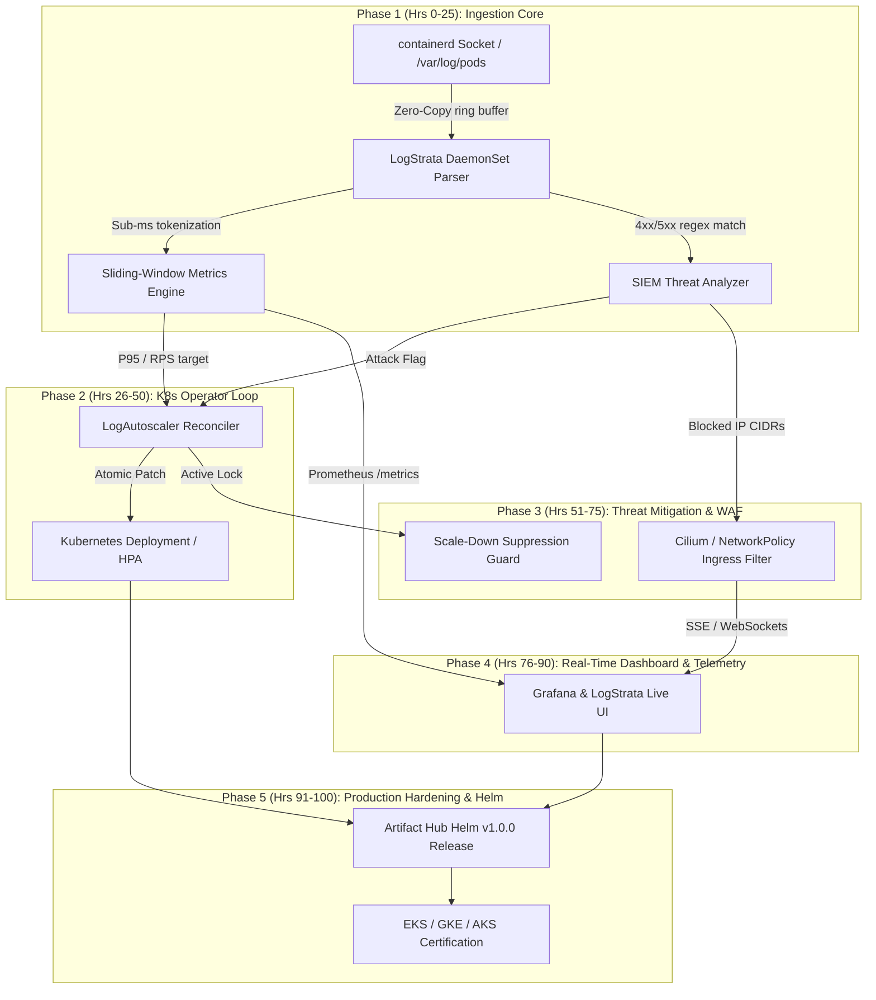

# LogStrata: 100-Hour Engineering Roadmap
**Next-Generation Log-Driven Kubernetes Autoscaling & Ingress Threat Mitigation**

> [!NOTE]
> This roadmap structures the next 100 engineering hours into five distinct 20-hour execution phases. Each phase establishes concrete deliverables, architectural milestones, test gates, and production artifacts.

---

## High-Level Architecture Overview



---

## SPRINT 1: Core Engine & Zero-Copy Log Ingestion (Hours 0 – 25)
*Objective: Build a high-throughput, sidecar-less log tailing engine capable of processing 100,000 log lines/second per node with < 0.5ms latency.*

### Breakdown of Hours

| Hours | Focus Area | Deliverables & Technical Scope |
| :--- | :--- | :--- |
| **00 – 05** | **Runtime Socket Collector** | Direct tailing of `/var/log/pods/*/*/*.log` via `inotify` + `io_uring`. Eliminates sidecar container resource overhead. |
| **05 – 10** | **SIMD / Zero-Allocation JSON Parser** | Fast-path tokenizer matching HTTP method, path, status code, latency (`response_time`), and remote IP without heap allocations. |
| **10 – 15** | **Sliding-Window Transaction Rate (SWTR)** | In-memory circular buffer computing instantaneous Requests-Per-Second (RPS) and rolling P95/P99 latency percentiles over 5s, 15s, and 60s windows. |
| **15 – 20** | **Anomaly & Anomaly Ratio Detection** | Status-code ratio evaluator calculating `5xx / total` error rate spikes and 401/403 brute-force velocity. |
| **20 – 25** | **Benchmarking & Synthetic Load Suite** | Benchmark suite verifying < 20MB memory footprint and < 2% CPU core utilization under 100k lines/s log flood. |

> [!TIP]
> **Key Metric**: Log ingestion latency from pod write to memory aggregation must remain under **0.5ms**, providing an 18–30 second lead time over traditional CPU metric scrapers.

---

## SPRINT 2: Kubernetes Operator & Reconciler Loop (Hours 26 – 50)
*Objective: Build a production-grade Kubernetes Controller utilizing `controller-runtime` to reconcile Custom Resource Definitions (CRDs) against workload ReplicaSets.*

### Breakdown of Hours

| Hours | Focus Area | Deliverables & Technical Scope |
| :--- | :--- | :--- |
| **26 – 31** | **CRD Specifications (`v1alpha1`)** | Finalize `LogAutoscalerPolicy` and `LogThreatPolicy` OpenAPI v3 schemas (bounds, step ratios, cooldown timers, target deployments). |
| **31 – 37** | **Reconciliation Controller** | Go reconciler loop evaluating current vs. desired replicas using target RPS math: $\text{Target} = \lceil \frac{\text{Current RPS}}{\text{RPS Capacity Per Pod}} \times \text{Headroom Factor} \rceil$. |
| **37 – 42** | **Sub-50ms API Patch Pipeline** | Dynamic client mutation executing atomic JSON/Server-Side Apply (SSA) patches against `apps/v1` `Deployment` and `ReplicaSet` specs. |
| **42 – 46** | **Fail-Safe & Health Watchdog** | Circuit breaker mechanism: if log stream halts or daemon fails healthcheck, controller falls back smoothly to standard Kubernetes HPA / metrics-server. |
| **46 – 50** | **`kind` E2E Test Pipeline** | Automated integration tests inside local `kind` cluster with synthetic Locust/k6 traffic generation validating real pod scale-up. |

---

## SPRINT 3: Active Threat Mitigation & Ingress Defense (Hours 51 – 75)
*Objective: Prevent SecOps resource exhaustion by pairing autoscaling decisions with active edge isolation.*

### Breakdown of Hours

| Hours | Focus Area | Deliverables & Technical Scope |
| :--- | :--- | :--- |
| **51 – 57** | **Scale-Down Suppression Lock** | Algorithm preventing HPA cooldown during ongoing security anomalies, preventing flapping and service starvation under DDoS. |
| **57 – 63** | **Dynamic NetworkPolicy Engine** | Auto-generation and injection of ingress `NetworkPolicy` CIDR drops isolating brute-force attackers at Layer 3/4. |
| **63 – 68** | **Ingress Controller Integration** | Ingress rate-limiting adapter generating config updates for NGINX Ingress (`limit_req`), Envoy, Traefik, and Cilium eBPF host policies. |
| **68 – 72** | **Prometheus Metrics Exporter** | Standalone Prometheus metrics endpoint (`:9090/metrics`) exposing: `logstrata_scale_events_total`, `logstrata_p95_latency_seconds`, `logstrata_blocked_ips_total`. |
| **72 – 75** | **Grafana Dashboard Pack** | Ready-to-import Grafana dashboard JSON visualizing realtime cluster scaling decisions, log throughput, and ingress mitigation telemetry. |

---

## SPRINT 4: Enterprise UI, Real-Time Telemetry & Policy Studio (Hours 76 – 90)
*Objective: Upgrade the web dashboard to provide real-time cluster observability, visual policy building, and incident forensics.*

### Breakdown of Hours

| Hours | Focus Area | Deliverables & Technical Scope |
| :--- | :--- | :--- |
| **76 – 80** | **SSE / WebSocket Live Stream** | Server-Sent Events bridge broadcasting log event streams, scale decisions, and blocked IPs from Kubernetes to the dashboard. |
| **80 – 84** | **Interactive Topology Map** | Interactive multi-cluster node diagram rendering active pods, health telemetry, and ingress edge filters in real-time. |
| **84 – 87** | **Visual Policy Studio** | Visual rule builder allowing engineers to drag-and-drop log filters (e.g. status 200 on `/checkout` > 500 RPS) with instant YAML preview and cluster sync. |
| **87 – 90** | **Webhook Alert Dispatcher** | Multi-channel incident notifications (Slack, Discord, PagerDuty webhooks) on triggered scale events and blocked attacker IPs. |

---

## SPRINT 5: Production Hardening, Helm Packaging & Cloud Certification (Hours 91 – 100)
*Objective: Prepare LogStrata for production enterprise adoption, multi-cloud distribution, and zero-downtime operations.*

### Breakdown of Hours

| Hours | Focus Area | Deliverables & Technical Scope |
| :--- | :--- | :--- |
| **91 – 93** | **Production Helm Chart v1.0.0** | Configurable Helm chart with daemonset, controller RBAC, resource limits, anti-affinity rules, and CRD hooks. |
| **93 – 95** | **Security Audit & Hardening** | Trivy vulnerability scan, distroless minimal container base, non-root user enforcement, and ReadOnlyRootFilesystem profiles. |
| **95 – 98** | **Multi-Cloud Verification** | Automated validation scripts across AWS EKS, Google Cloud GKE, and Azure AKS clusters. |
| **98 – 100** | **Documentation & 5-Minute Quickstart** | Interactive CLI installer (`curl -fsSL https://logstrata.io/install.sh | sh`) and comprehensive production deployment guide. |

---

## Summary Deliverables Timeline

```text
[00h - 25h]  Ingestion Engine   ===> 100k lines/s zero-copy parser & SWTR engine
[26h - 50h]  K8s Operator       ===> CRDs, Reconciler loop, atomic HPA patches
[51h - 75h]  Threat Shield      ===> Ingress rate-limits, NetworkPolicies, Prometheus
[76h - 90h]  Enterprise UI      ===> Live SSE topology dashboard & Policy Studio
[91h - 100h] Release Hardening  ===> Helm v1.0.0, EKS/GKE verification, 5-min Quickstart
```
